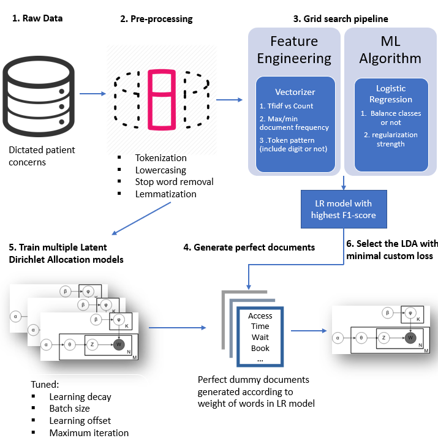

##Using existing manual labels to enhance LDA-based topic modelling
---
Code for the paper "Using existing manual labels to enhance LDA-based topic modelling of patient concerns"
Unfortunately, due to patient privacy, we cannot disclose data, so my experiments cannot be repeated, but I hope my method can be inspiring, and some functions can be reused.

###Dependencies
+ Python 3.5.2 
+ sklearn 0.21.3
+ wordcloud 1.5.0
+ spacy 2.1.4

Versions listed above are what I used

The _PredictScorer function in sklearn.metric._score was modified to adapt model selection of LDA. In line 94 originally it was:
`y_pred = estimator.predict(X)`
but LDA does not have `predict` method but `transform` method, thus I changed it to:
```
try:
    y_pred = estimator.predict(X)
except:
    y_pred = estimator.transform(X)
```
### Methode overview


###Data pre-processing
To prepare the text for analysis, we conducted several standard preprocessing steps, using the spaCy and sklearn python package. We converted all of the text to lowercase, removed the standard English stopwords defined by sklearn, plus an additional set of corpus-specific stopwords (see supplementary information), and performed lemmatization.
Code is in pre-processing jupyter notebook

### Training and selecting LDA models

1. Train a supervised model to generate dummy documents
   We randomly split the documents in a training set of 80% and a test set of 20%, then created an idealized single-topic dummy document for each class by concatenating the 100 words with the largest weight for that class.
2. Train and "validate" LDA model
   We run a grid search on LDA model to find the model give least custom loss 
Code is in clean_LDA_code jupyter notebook